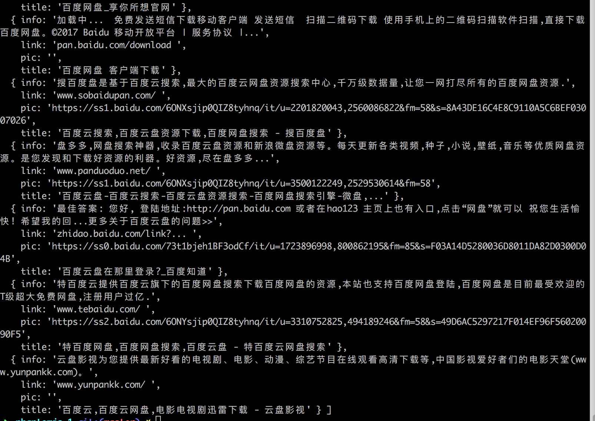

# 网页抓取分析服务系列之一（基础分析）

# 网页抓取分析服务系列之一（基础分析）笔记

##任务描述
安装phantomjs2.0，并查看webpage相关的API http://phantomjs.org/api/webpage/。
编写一个task.js脚本，参考官网的includeJs方法，实现根据传入的参数（关键字），抓取百度第一页对应该关键字的搜索结果。
将结果输出为json string回显。
回显的格式为

~~~
   {
       code: 1, //返回状态码，1为成功，0为失败
       msg: '抓取成功', //返回的信息
       word: '示例关键字', //抓取的关键字
       time: 2000, //任务的时间
       dataList:[   //抓取结果列表
           {
               title: 'xx',  //结果条目的标题
               info: ‘’, //摘要
               link: ‘’, //链接            
               pic: '' //缩略图地址
               }
       ]
   }
~~~
   
##任务注意事项
多查API，学以致用
对于抓取的异常情况及时捕获并处理
结果中非自然结果的部分抛弃掉（广告、阿拉丁等），提前人工查看一下搜索结果，大多信息格式一致的都是自然结果，观察自然结果的class和相关结构特征。

##笔记部分
基于phantomjs2.0进行实现有两种实现方案，一种是使用基于全局的 http://phantomjs.org/ ，另外一种是封装的模块 phantom - Fast NodeJS API for PhantomJS -https://github.com/amir20/phantomjs-node
我选取的是其中第二种
##phantom介绍

>PhantomJS是一个基于WebKit的服务器端JavaScript API，它基于 BSD开源协议发布。PhantomJS无需浏览器的支持即可实现对Web的支持，且原生支持各种Web标准，如DOM 处理、JavaScript、CSS选择器、JSON、Canvas和可缩放矢量图形SVG。PhantomJS主要是通过JavaScript和CoffeeScript控制WebKit的CSS选择器、可缩放矢量图形SVG和HTTP网络等各个模块。PhantomJS主要支持Windows、Mac OS、Linux三个平台，并且提供了对应的二进制安装包，读者可在下载页面选择对应的版本下载解压即可使用。GitHub上还提供了GitHub、Google Code、BitBucket等各种方式的源码下载地址。

[more](http://www.infoq.com/cn/news/2015/01/phantomjs-webkit-javascript-api)
##Installation

###Node v6.x and later

node6.x版本可以直接安装

~~~
$ npm install phantom --save
~~~

###Node v5.x
node5.x版本则通过以下命令安装

~~~
$ npm install phantom@3 --save
~~~

###Versions older than 5.x, install with

低于node5.x版本则通过以下命令安装

~~~
$ npm install phantom@2 --save
~~~

如果不清楚自己node版本的可以根据自己的node版本管理器进行查看，这里我建议安装一下node 7.6版本原生支持async/await  

如果是通过n进行管理的则直接输入

~~~
n
~~~

如果是通过nvm进行管理的则输入

~~~
nvm current
~~~

首先我们通过一个官方的demo去看一下相关用法
因为涉及了async/await 如果不了解的可以先看一下阮一峰老师的 http://www.ruanyifeng.com/blog/2015/05/async.html

~~~
const phantom = require('phantom');//导入模块
//async解决回调问题,es7的内容
(async function() {
     // await解决回调问题，创建一个phantom实例
    const instance = await phantom.create();
    //通过phantom实例创建一个page对象，page对象可以理解成一个对页面发起请求和处理结果这一集合的对象
    const page = await instance.createPage();
    //页面指向的是哪个一个url
    await page.on("onResourceRequested", function(requestData) {
        console.info('Requesting', requestData.url)
    });
  //得到打开该页面的状态码
    const status = await page.open('https://stackoverflow.com/');
    console.log(status);
//输出该页面的内容
    const content = await page.property('content');
    console.log(content);
   //退出该phantom实例
    await instance.exit();
}());

~~~

 Node 7.x版本以上可以通过 
 
 ~~~
 node --harmony-async-await file.js
 
 ~~~
 
 直接运行
 
 回到任务要求
 
 >实现根据传入的参数（关键字），抓取百度第一页对应该关键字的搜索结果
 
 node传入参数的方式 以上面的命令作为例子
 
 ~~~
 node --harmony-async-await argv1 argv2 ...
 ~~~
 
 在执行的js文件中通过
 
 ~~~
 process.argv[index]
 ~~~
 
 进行获取，这里就简单跳过了
 
 按照上面的demo的步骤首先我们先做好以下准备工作，
 首先我们从百度搜索里面观察以下通过搜索的url
 ~很简单的实验后可以得到我们所需要的url
 
 ~~~
 https://www.baidu.com/s?wd=keyword
 ~~~
 
 ~~~
 const phantom = require('phantom');
 if (process.argv.length < 3) {
    console.log("node --harmony-async-await demo1.js keyword");
    return;
}
//引入模块 检查是否有传入关键词
let keyword = process.argv[2];
let url = encodeURI(`https://www.baidu.com/s?wd=${keyword}`);
//获取Keyword拼接后得到需要的url，需要注意的是这里要对url进行一下处理，否则有可能搜索不出来
 ~~~
 
 ~~~
const instance = await phantom.create();
const page = await instance.createPage();
const status = await page.open(url);
//依然是准备工作 

let result = await page.evaluate(function() {
            return $('.result.c-container').map(function() {
                return ({
                    title: $(this).find('.t').text() || '',
                    link: $(this).find('.c-showurl').text() || '',
                    info: $(this).find('.c-abstract').text() || '',
                    pic: $(this).find('.general_image_pic img').attr('src') || ''
                });
            }).toArray();
        });
        //最后得到的是一个封装结果的类数组
        //这里只简单说明一下~百度本身是有引入jquery的，我理解page.evaluate是直接在当前页面上运行脚本~所以就可以直接使用了
 ~~~
 

使用前需要

~~~
npm install
~~~

运行要求

需要在node 7.x以上

使用指令:

~~~
node --harmony-async-await demo1.js keyword
//keyword 是需要搜索的关键词
~~~

附带指令

~~~
node --harmony-async-await demo1.js keyword pic
//keyword 是需要搜索的关键词
~~~

获得当前页面的图片并渲染出来

结果

pic:

	

