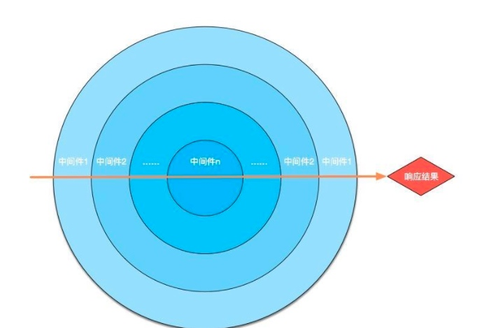

# 网页抓取分析服务系列之四（数据交互）笔记
任务描述
>开发对应的前端界面，使用技术栈不限，越简单越好。输入包含一个输入框（输入关键字），一个下拉列表（选择对应的UL），一个提交按钮。
关键字输入做不能为空的校验，输入后发起异步请求，请求上阶段的服务。
在上阶段的服务中增加一个数据二次处理功能，对于返回的结果中有缩略图片的，下载图片到本地，并确保下载后的图片能被访问。
入库后，返回信息给前端，前端展示对应的抓取结果，以表格展示，图片加载本地已下载的图片

---

任务注意事项
>静态文件服务器需用nodejs实现，也是8080端口，可以使用现成框架（推荐使用koa2）
图片保存的路径需要注意生成唯一ID作为图片名，在数据库中需要存储该ID以便后续展现

---

##随便聊聊。。
比较早完成了这部分的学习。。比较可惜由于学校的事情比较多没有很好安排到时间~不过因为既然完成了这部分内容还是要做一下总结。
**[各任务的代码](https://github.com/Sunshine168/ife)**
ps:由于第二个任务只是在第一个任务上做了一个简单设备抓取要求 所以我直接合并在任务一种了
这部分的代码放在了 phantomjs_3 

##后端框架
我选取的是koa2作为我的后端框架，如果你对koa2不熟悉可以移步[廖老师的koa教程](http://www.liaoxuefeng.com/wiki/001434446689867b27157e896e74d51a89c25cc8b43bdb3000/001434501579966ab03decb0dd246e1a6799dd653a15e1b000)
我这里只简单说一下我选取koa2的原因。。不为别的就因为用的比较爽~而且我还是小菜鸟一枚=.=
首先，koa作为一个轻小的框架，使用起来十分简单。
建议可以了解一下浏览器输入一个url后会发生什么事情~这样就可以更好的理解整个过程了
起步演示代码

~~~
//你需要通过npm init project and npm install koa2
const Koa = require('koa'); //导入koa
const app = new Koa(); //实例化一个Koa对象
// log request URL:(增加一个中间件)
app.use(async(ctx, next) => {
	console.log(`Process ${ctx.request.method} ${ctx.request.url}...`);//打印请求方法和请求的url
	var
		start = new Date().getTime(),//记录开始访问的时间
		execTime;
	await next();
	execTime = new Date().getTime() - start;//得到结束访问的时间
	ctx.response.set('X-Response-Time', `${execTime}ms`);//设置相应时间
});
/*我们关心的request和response都在ctx当中，在起步的时候我们可以单纯理解成我们是不断的增加中间件去处理进来的request加工成出去的response*/
app.listen(3000);//监听端口
~~~

**通过这个可以更好理解koa，需要注意的是中间件的执行顺序是从第一个中间件到最后一个中间件然后逆序从最后一个中间件到第一个中间件然后相应结果的。图是网上找的~**

然后，从需要的角度出发，你需要处理一下静态文件，例如我们本次任务的html又或者是图片，所以你需要增加一个中间件

~~~
const static = require('koa-static');//导入处理静态文件的中间件
const convert = require('koa-convert');//将支持1.0的中间件转换成支持2.0的中间件
const staticPath = './static';//设置静态目录
app.use(convert(static(path.join(__dirname, staticPath))));//使用处理静态文件的中间件
~~~

但是需要注意的是如果需要使用模板引擎请把使用模板引擎的中间件放在静态文件前。

~~~
//加载模板引擎
app.use(views(path.join(__dirname, './views'), {
        extension: 'ejs'
    }))
    //静态目录
const staticPath = './static';
//使用静态资源中间件
app.use(convert(static(path.join(__dirname, staticPath))));

~~~

做了那么多准备，更需要看看效果才对了，如何去匹配那些url？去看到我们的内容

这个时候你需要使用一个叫router的中间件了 

关于路由的内容(由于内容没整理好，所以这部分大家可以自行了解一下)
以下的写法是通过定义父路由，再将子路由加载到上去达到不断适配url的目的

完整代码

~~~
const Koa = require('koa');
const fs = require('fs');
const router = require('koa-router');
const path = require('path');
const views = require('koa-views');
const static = require('koa-static');
const convert = require('koa-convert');
const bodyparser= require('koa-bodyparser');
const app = new Koa();
app.use(bodyparser());

app.use(async(ctx, next) => {
    const start = new Date();
    await next();
    const ms = new Date() - start;
    console.log(`${ctx.method} ${ctx.url} - ${ms}ms`);
});

//加载模板引擎
app.use(views(path.join(__dirname, './views'), {
        extension: 'ejs'
    }))
    //静态目录
const staticPath = './static';
//使用静态资源中间件
app.use(convert(static(path.join(__dirname, staticPath))));

let index = new router();
index.get('/', async(ctx) => {
	  console.log("post?");
    let title = '百度前端任务'
    await ctx.render('index', {
        title,
    })
});

//装载所有子路由
let routers = new router();
//加载任务路由
let task = require('./task/taskHandler').router;
routers.use('/search',task.routes(),task.allowedMethods());
routers.use('/',index.routes(),index.allowedMethods());
app.use(routers.routes()).use(routers.allowedMethods());
app.listen(3000);

~~~
需要注意，async和await是在node7以上才支持，如果你的node环境低于7请使用babel。
也许你看完上面的代码还对async/await有疑问~
在起步的时候你可以单纯这样理解，await必须在async声明的函数内使用，使用了await的函数会代表该代码会异步执行。我们只需要按照使用要求去使用就可以了。至于深入理解CO模块的问题~=,=  目前还没能深入研究。。。

##抓取图片

~~~
const mkdirp = require('mkdirp');
const dir = './static/img';
const fs = require('fs');
const request = require('request');
const uuid = require('uuidv4');
//需要在原来基础上加入的模块

//.....抓取  result是抓取结果

// download pic
		result.forEach((item) => {
			if (item['pic'] != '') {
				let pid = uuid().replace(/-/g, "");//生成图片名字
				item['pid'] = pid + ".jpg";
				mkdirp(dir, (err) => {
					if (err) {
						console.log(err);
					}
					//判断存储的静态文静夹是否存在
				});
	request(item.pic).pipe(fs.createWriteStream(dir + '/' + item.pid))//打开文件流下载图片
			}
		})
~~~

[完整代码](https://github.com/Sunshine168/ife/blob/master/phantomjs_3/task/task.js)

